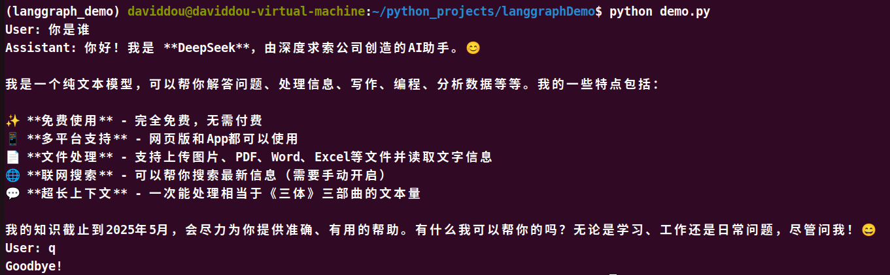

# LangGraph入门：搭建一个聊天机器人

https://github\.langchain\.ac\.cn/langgraph/tutorials/get\-started/1\-build\-basic\-chatbot/

https://docs\.langchain\.com/oss/python/langgraph/thinking\-in\-langgraph


1. 安装依赖包

```Plain Text
langchain-deepseek
langgraph
langsmith
langchain
```


pip install \-i https://pypi\.tuna\.tsinghua\.edu\.cn/simple \-r requirements\.txt


2. 创建stategraph

stategraph是langgraph的核心，用于构建有状态、可循环的工作流。通过显式状态（state）存储应用的全量上下文，通过节点（node）封装业务逻辑，通过边（edge）定义流程流转规则，实现“状态驱动流程，流程修改状态”的闭环。

状态：应用的“全局上下文仓库”，是一个可更新的键值对结构，包括图的模式和处理状态更新的reducer函数

节点：业务逻辑的最小执行单元，如调用LLM、执行工具等

边：定义流程流转，分为普通边和条件判断边

```Plain Text
class State(TypeDict):
    messages: Annotated[list, add_messages]
graph_builder = StateGraph(State)
```


3. 添加节点


**节点**代表工作单元，通常是常规函数。我们在这里添加一个“chatbot”节点

首先选择deepseek\-v4\-flash聊天模型

```Plain Text
llm = init_chat_model(
    model="deepseek-v4-flash", 
    model_provider="deepseek"
)
```


然后将聊天模型整合到chatbot节点中

```Plain Text
def chat_bot(state: State):
    return {"messages": [llm.invoke(state["messages"])]}
```

添加chat\_bot节点

```Plain Text
graph_builder.add_node("chatbot", chatbot)
```


chatbot节点将当前的状态state作为输入，并返回一个字典，字典包含一个在“messages”键下的更新后的消息列表。这是所有节点返回的数据的基本格式。


LangGraph 状态（State）中对消息列表（通常是 `messages` 键）配置了 **`add_messages`**** 还原函数（Reducer），在默认情况下，如果一个状态键（Key）没有指定 Reducer，LangGraph 的行为是直接覆盖（Overwrite）。即节点返回什么，状态就变成什么。**我们状态中的 add\_messages 函数会将 LLM 的响应消息附加到状态中已有的任何消息上。


4. 添加入口点

添加一个`入口`点，以告诉图每次运行时**从哪里开始工作**

```Plain Text
graph_builder.add_edge(START, "chat_bot")
```


5. 添加出口点

指示**图应该在哪里完成执行**。这对于更复杂的流程很有帮助，但即使在像这样的简单图中，添加一个结束节点也能提高清晰度。

```Plain Text
grapg_builder.add_edge("chat_bot", END)
```

6. 编译图

在运行图之前，我们需要编译它。我们可以通过在图构建器上调用 compile\(\)

```Plain Text
graph = graph.builder.complile()
```

7. 功能函数

接收你的输入，把它送入构建好的 LangGraph 工作流中运行，并实时打印大模型返回的回复


```Python
# 注意：每次你输入新话，该函数都会重新创建一个**全新的** initial_state。
# 由于没有配置 LangGraph 的持久化内存（Checkpointer），图在运行完一次后就把历史记录丢掉了。
def stream_graph_updates(user_input: str):
    # 将用户输入的纯文本打包为langgraph能识别的输入格式
    initial_state = {"messages": [HumanMessage(content=user_input)]}
    # 将准备好的数据扔给图的起点，开始运行
    for event in graph.stream(initial_state):
        # 拿到节点实际返回的数据
        for value in event.values():
            # 从更新的数据中提取出大模型说的那句话，并打印在屏幕上
            print("Assistant:", value["messages"][-1].content)
```

测试结果：




