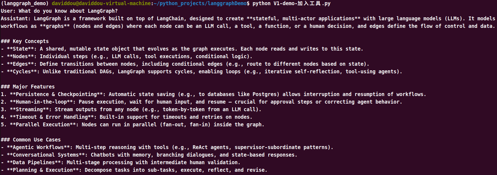

# LangGraph进阶（一）：聊天机器人增加搜索工具

https://app\.tavily\.com/home

使用 TavilySearch api 作为搜索工具

1. 初始化State和图构建器

```Python
class State(TypeDict):
    messages: Annotated[list, add_messages]
    
graph_builder = StateGraph(State)
```

2. 导入环境变量和初始化工具


```Plain Text
from langchain_tavily import TavilySearch
os.environ["TAVILY_API_KEY"] = ""
tool = TavilySearch(max_results=2)
```


3. 初始化大模型并绑定工具


```Python
llm = init_chat_model(
    model = ""
    model_provider = ""
)
llm_with_tools = llm.bind_tools(tools) 
```

4. 定义聊天机器人节点

5. 自定义工具执行节点

6. 定义条件路由逻辑

7. 构建图的连接与编译





