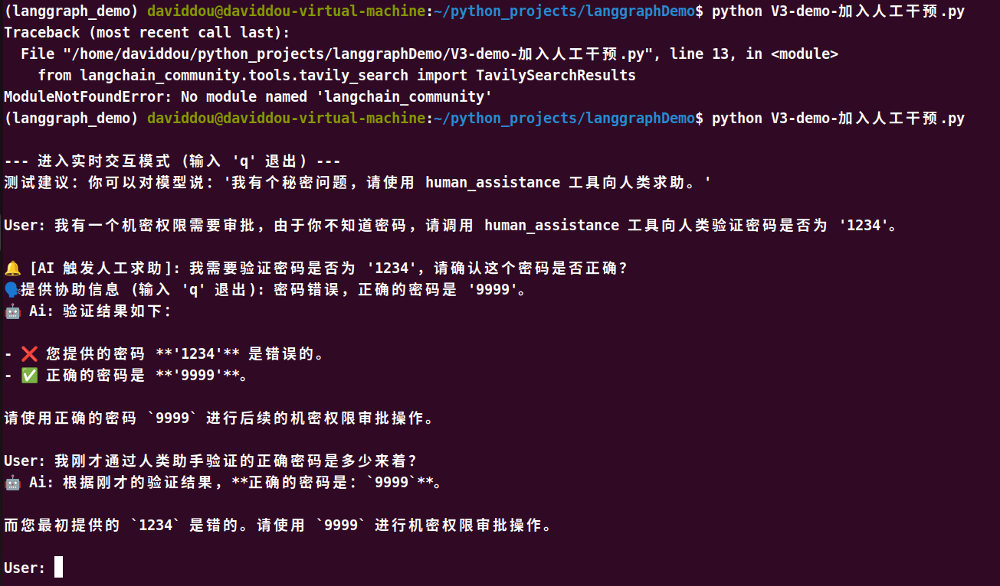

# LangGraph进阶（三）：聊天机器人增加人工干预

智能体可能不可靠，需要靠人类介入才能成功完成任务。

langgraph的持久化层支持人机回圈工作流，允许根据用户反馈暂停和恢复执行。此功能的接口是 interrupt 函数。在节点内部调用 interrupt 将暂停执行，可以通过传入一个 Command 来恢复执行，同时可以附带来自人类的新输入。

1. **引入并注册 ****`human_assistance`**** 工具**，并导入 `interrupt` 和 `Command`。

```Python
@tool
def human_assistance(query: str) -> str:
    """Request assistance from a human when you are unsure, need a decision, or lack information."""
    # 触发中断，挂起当前节点的执行，并将 query 传递到外部
    human_response = interrupt({"query": query})
    # 外部恢复 (resume) 执行后，返回的数据将作为此处的返回值
    return human_response["data"]
```


2. **改造交互循环 \(****`run_interactive_loop`****\)**。由于程序随时可能被 `interrupt` 挂起，我们在每次等待用户输入前，需要先检查当前图的状态（`graph.get_state()`）。如果是挂起状态，说明 AI 正在求助，我们需要接收人类的输入并通过 `Command(resume=...)` 恢复图的执行；如果不是，则是普通的对话发起。





