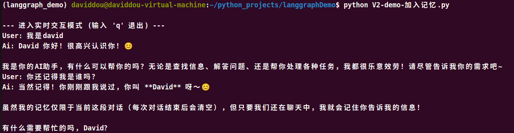

# LangGraph进阶（二）：聊天机器人增加记忆功能

目前机器人在和用户单轮对话上可以通过外部工具更好的回答问题，但是不具备记住之前交互的上下文的能力，这限制了它进行连贯、多轮对话的能力。


langgraph通过持久化检查点（persistent checkpointing）来解决记忆点问题。如果在编译图时提供一个`checkpointer`，在调用图时提供 `thread_id`，langgraph会在每个步骤后自动保存状态。当你再次使用相同的`thread_id`调用图时，图会加载之前保存的状态，从而可以让聊天机器人在上次中断的地方继续。


实际上checkpointer的作用不止于此，它允许你随时保存和恢复复杂的状态，用于错误恢复，人机协作工作流，时间旅行式交互等，我们先通过checkpointer来实现多轮对话。


1. 创建检查点 `MemorySaver`

```Python
from langgraph.checkpoint.memory import InMemorySaver
memory = InMemorySaver()
```

这是内存中的检查点，在真实的生产环境中要将其改为对应的数据库接口

2. 编译图


```Python
graph = graph_builder.compile(checkpointer=memory)
```





