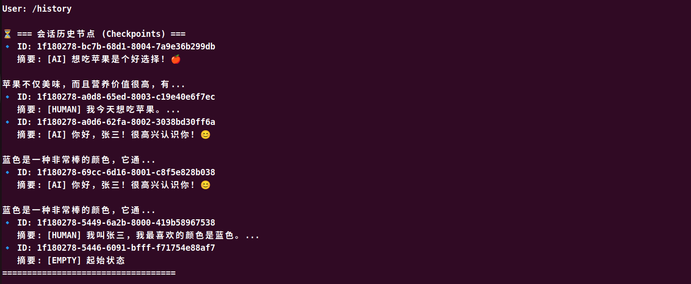

# LangGraph进阶（四）：聊天机器人增加时间旅行

在 LangGraph 中，“时间旅行”（Time Travel）是一个非常强大的特性。它允许我们查看会话的历史状态（Checkpoints），并且可以“穿越”回过去的某个节点，修改输入或直接从那里开启一个新的对话分支（Branching）。

为了在终端交互中实现这个功能，我们需要在你的交互循环中增加两个特殊指令：

1. **`/history`**：获取并打印当前 `thread_id` 下所有的历史检查点（Checkpoint ID）。

2. **`/revert <checkpoint_id>`**：将目标检查点 ID 注入到配置中，让你的下一句话直接从这个历史节点“分叉”重新执行。

```Python
if user_input.lower() == "/history":
    print("\n⏳ === 会话历史节点 (Checkpoints) ===")
    # 获取该 thread_id 下的所有历史状态
    history_states = list(graph.get_state_history(config))
    if not history_states:
        print("当前没有历史记录。")
        continue
        
    # 打印最近的 10 条历史状态
    for s in history_states[:10]:
        c_id = s.config['configurable']['checkpoint_id']
        # 提取最后一条消息作为摘要
        if s.values.get("messages"):
            last_msg = s.values["messages"][-1]
            msg_preview = f"[{last_msg.type.upper()}] {last_msg.content[:30]}..."
        else:
            msg_preview = "[EMPTY] 起始状态"
        print(f"🔹 ID: {c_id}\n   摘要: {msg_preview}")
    print("===================================\n")
    continue
```


```Python
if user_input.lower().startswith("/revert"):
    parts = user_input.split()
    if len(parts) == 2:
        target_checkpoint_id = parts[1]
        print(f"\n[系统提示] 🌀 目标已锁定！你现在的状态停留在节点 `{target_checkpoint_id}`。")
        print("接下来发送的消息，将从该节点分叉 (Branching) 继续对话。")
    else:
        print("\n[系统提示] ❌ 指令错误。用法: /revert <checkpoint_id>")
    continue
```




